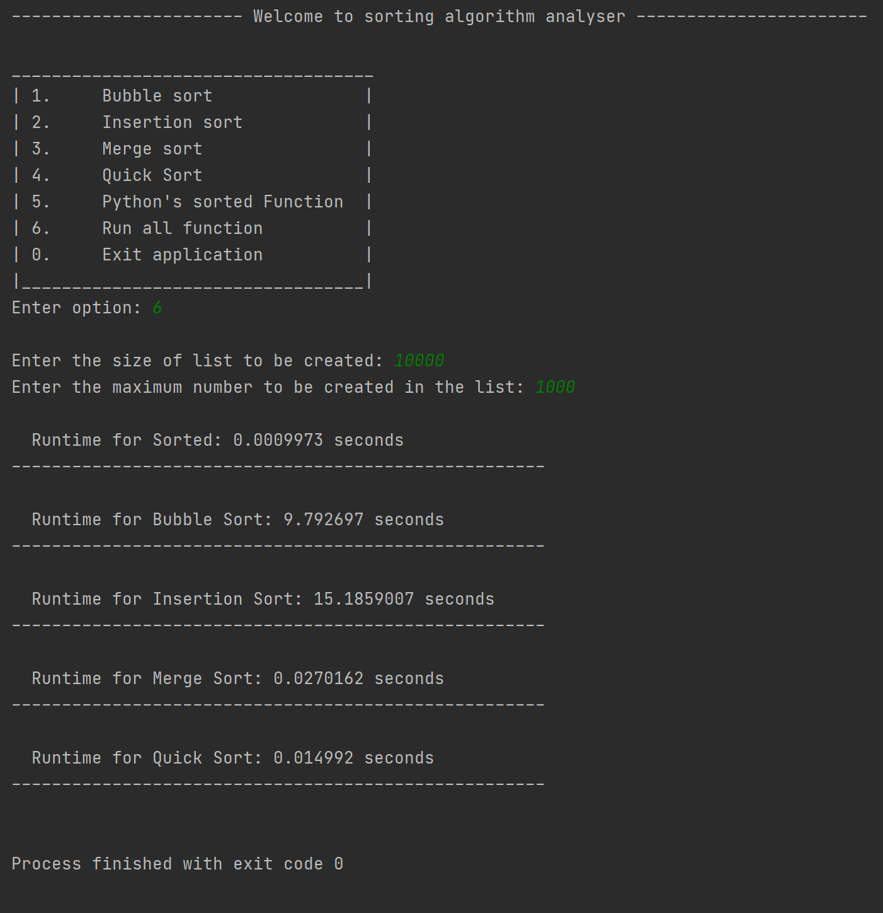

## A software that calculates the runtime of some popular sorting algorithms such as:

- [x] [Bubble sort](sort_functions.py)
- [x] [Insertion sort](sort_functions.py)
- [x] [Merge sort](sort_functions.py)
- [x] [Quick sort](sort_functions.py)
---
#### It can also analyse Python's sorted function alongside the above algorithms.

### To use run [main.py](main.py)

*Screenshots* 

 

